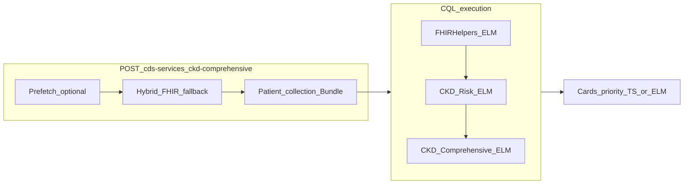

# CPG → CQL：`ckd-comprehensive` 實作計畫

## 文件目標與硬約束

- 設計來源：[docs/CPG/CPG_CQL_enhance.md](CPG_CQL_enhance.md) Phase 1（方法論已在文件內完成）+ Phase 2（**四個產出**落地）。
- **禁止修改**：[src/cds/egfrCheckHookHandler.ts](../../src/cds/egfrCheckHookHandler.ts)、[src/cds/ckdHookHandler.ts](../../src/cds/ckdHookHandler.ts)、[src/cds/ckdRiskCardBuilder.ts](../../src/cds/ckdRiskCardBuilder.ts)、[cql/CKD_Risk.cql](../../cql/CKD_Risk.cql) 及任何既有 `ckd-risk`／`egfr-check` 專用邏輯檔（僅能**新增**檔案並在 `routes`／`discovery` **加掛**新服務）。
- `CKD_Comprehensive.cql` **不得重複** `CKD_Risk.cql` 既有 **Terminology / define**；僅能 `include CKD_Risk version '1.0.0' called Risk` 並以 `Risk."…"` 引用（與現有 CKD_Risk 使用引號定義名一致，見 [cql/CKD_Risk.cql](../../cql/CKD_Risk.cql)）。
- **不實作** 3 個月趨勢／egfr-check 趨勢：僅保留 CQL **TODO v2** 註解。
- **null 語意**：與現行 `ckd-risk` 卡片一致——風險因子 `null` 視為「資料不足」，卡片內以繁中文句標示；布林組合一律用 `is true`／`is false`，避免把 `null` 當成 false（HighRiskProfile、CriticalTestingGap 等）。

## 設計與文件落差（實作時須修正之處）

| 文件片段 | 調整 |
|---|---|
| `include FHIRHelpers version '4.0.1'` | 與 `CKD_Risk` 對齊為 **4.1.0**（見 [cql/CKD_Risk.cql](../../cql/CKD_Risk.cql)）。 |
| 自訂 `valueset "eGFR LOINC Codes"` | 違反「不重複術語／觀察定義」精神；**轉介規則**改寫為僅使用 `Risk."MostRecentEgfrValue"`（已在 CKD_Risk 以 LOINC **62238-1 / 33914-3** 定義）。 |
| `ckd-comprehensive-handler.ts` 偽碼（`RuleEngine`、`buildFHIRBundle`、`./types`） | 改為本專案既有模式：`CdsHooksRequest`／`CdsCard` 與 [src/cds/ckdHookHandler.ts](../../src/cds/ckdHookHandler.ts) 相同結構；FHIR Bundle 組裝比照 [src/cql/ckdRiskElmExecutor.ts](../../src/cql/ckdRiskElmExecutor.ts) `buildPatientBundle`。 |
| Card `extension` 為單一 JSON 物件 | 本專案 Cards 使用 **陣列** `[{ url, valueString }]`（見 [src/cds/ckdRiskCardBuilder.ts](../../src/cds/ckdRiskCardBuilder.ts)）；建議新增 **常數 URL**（例如 `urn:cds-service:cpg-source`、`urn:cds-service:evidence-grade`、`urn:cds-service:source-library`、`urn:cds-service:rule-id`）與現有 `urn:cds-service:rule-engine` 並列，避免破壞既有解析。 |
| `flags['Risk.MissingeGFR']` | ELM 表達式結果鍵名不會帶 `Risk.` 前綴；應以 Comprehensive library 內 **新 define** 包一層（例如 `MissingeGFRFlag` 直接等於 `Risk."MissingeGFR"`）或由 executor **明確映射**欄位名。 |

## 架構資料流（目標）

- **Hybrid**：複用 [src/fhir/fhirClient.ts](../../src/fhir/fhirClient.ts) 既有 `getPatient`、`searchActiveConditions`、`searchObservationsForCkdRisk`（與 `ckd-risk` 相同資料範圍即可滿足 `Risk.*`）；**不必**強制新增 `latestEGFR` prefetch 鍵——觀察集已含 eGFR；若仍要與文件一致，可選擇性增加第四 prefetch 字串於 Discovery，並在 handler 合併進 observations（注意去重）。

## 實作步驟（建議順序）

### 1) 新增 `cql/CKD_Comprehensive.cql`

- `library CKD_Comprehensive version '1.0.0'`；`using FHIR version '4.0.1'`；`include FHIRHelpers version '4.1.0'`；`include CKD_Risk version '1.0.0' called Risk`；`context Patient`。
- 實作文件表格五個 define（命名與文件一致），每則上方繁中註解：`// CPG Source: … | Evidence Grade: …`。
- **HighRiskProfile**：`(Risk."HasDiabetes" is true) or (Risk."HasHypertension" is true) or (Risk."AgeOver60" is true)`（心臟病／肥胖若納入「高風險輪廓」需與臨床確認；文件 Phase 2 表僅列 DM／HTN／Age>60，建議**嚴格依表**實作以免擴張範圍）。
- **AnnualUACROverdue**：`HighRiskProfile is true and Risk."MissinguACR" is true`。
- **ImmediateReferralNeeded**：`Risk."MostRecentEgfrValue" is not null and Risk."MostRecentEgfrValue" < 30`（單位與 CKD_Risk 一致假設為臨床常用閾值；detail 文案註明 LOINC）。
- **CriticalTestingGap**：`Risk."MissingeGFR" is true and Risk."MissinguACR" is true`（兩者皆為明確布林）。
- **ComprehensiveRiskScore**：僅在 `is true` 時加權 1，其餘不加分；**不**把 `null` 當 false 寫進 OR 條件。
- 檔尾 **TODO v2**（繁中）：egfr-check 趨勢、3 個月持續性。

### 2) 產出 `elm/CKD_Comprehensive.json`

- 使用既有 [scripts/cql-compile-pom.xml](../../scripts/cql-compile-pom.xml) 或文件所述 CLI，**一次編譯**並確認 `cql-execution` Repository 需載入 **`FHIRHelpers` + `CKD_Risk` + `CKD_Comprehensive`**（順序與 [src/cql/ckdRiskElmExecutor.ts](../../src/cql/ckdRiskElmExecutor.ts) 相同模式擴充）。
- 若編譯器對 `include` 產物有路徑要求，於計畫執行時修正 pom／輸入目錄（不改 `CKD_Risk.cql`）。

### 3) 新增 `src/cql/ckdComprehensiveElmExecutor.ts`

- 仿 `evaluateCkdRiskWithElm`：建立 `cql.Repository({ CKD_Comprehensive, CKD_Risk, FHIRHelpers })`，`executor.exec` 後讀取 **CKD_Comprehensive** 之 expression 結果。
- 匯出 **強型別** `CkdComprehensiveElmResult`（五個 define + 供卡片用的 `MissingeGFR`／`MissinguACR` 若需從 Risk 再讀一次）。
- `USE_ELM=false` 時：新 handler 內實作 **僅供 comprehensive 使用** 的 TS 對齊層（可從現有 `evaluateCkdRiskWithTs` **複製邏輯到新檔**的 private 函式，**不**改 `ckdHookHandler`），避免修改禁止檔案。

### 4) 新增 `src/cds/ckdComprehensiveHookHandler.ts` + `ckdComprehensiveCardBuilder.ts`（建議拆分）

- 輸入解析：`patient`／`conditions`／`observations` 與 `ckd-risk` 相同 unpack 邏輯（可複製 [src/cds/ckdHookHandler.ts](../../src/cds/ckdHookHandler.ts) 中的 `extractBundleResources` 等 **private 複本**至新檔，避免 import 並修改舊 handler）。
- **USE_ELM**：先跑 `ckdComprehensiveElmExecutor`；失敗則 TS 對齊 + `TS_FALLBACK`（與現行 extension 慣例一致）。
- **卡片優先序**（嚴格依文件 72–78 行）：critical → ImmediateReferralNeeded → AnnualUACROverdue → 個別 Missing eGFR／uACR（且未觸發 CriticalTestingGap）→ info 摘要（含分數與「資料不足，請人工確認」列舉）。
- **extension**：`rule-engine` 字串建議為實際觸發之 define 名稱（如 `AnnualUACROverdue`）；引用 Risk 規則的卡片則用 `MissingeGFR`／`MissinguACR` 等明確 id。

### 5) Discovery 與路由

- 新增 service definition（可放 [src/cds/ckdServiceDefinition.ts](../../src/cds/ckdServiceDefinition.ts) 或獨立檔）：`id: 'ckd-comprehensive'`、`href` 指向 `/cds-services/ckd-comprehensive`，`prefetch` **至少**與 `ckd-risk` 相同三鍵（見現有 [src/cds/ckdServiceDefinition.ts](../../src/cds/ckdServiceDefinition.ts)）；可選第四鍵 `latestEgfr`。
- [src/cds/routes.ts](../../src/cds/routes.ts)：`getDiscoveryResponse([egfrCheckService, ckdRiskService, ckdComprehensiveService])` 並 `app.post('/cds-services/ckd-comprehensive', …)`。

### 6) 文件產物：`README-ckd-comprehensive.md`

- 放置建議：[docs/CPG/README-ckd-comprehensive.md](README-ckd-comprehensive.md)（與本檔同目錄），內容含：CPG→CQL 摘要表、三服務 ASCII 關係圖、規則表、**需載入兩份 ELM**（CKD_Risk + CKD_Comprehensive）+ FHIRHelpers、null 原則、TODO v2。
- **不**強制把 `ckd-comprehensive-hook.json` 當獨立 runtime 檔；若需保留 JSON 範本可併入 README 程式碼區塊供 Postman 參考。

### 7) 驗證與選配

- **Postman**：[postman/CDS-Service-E2E.postman_collection.json](../../postman/CDS-Service-E2E.postman_collection.json) 新增 `ckd-comprehensive` 至少一筆有／無 prefetch（對齊 hybrid）。
- **前端**（建議）：[frontend/src/App.tsx](../../frontend/src/App.tsx) 與 [frontend/src/copy/zhTwUi.ts](../../frontend/src/copy/zhTwUi.ts) 增加第三個 `serviceId`，Prefetch 開關邏輯沿用「依服務」模式；否則僅能 Postman 手測。
- **dev_readme.md**：補上新端點與編譯步驟；更新頂部歷史與記錄時間（依你方 Cursor 慣例）。

## 風險與待確認（單點決策）

- **HighRiskProfile 是否納入心臟病／肥胖**：文件 Phase 2 表與 Phase 1-C 範例不完全一致；建議實作時**以 Phase 2 表（DM OR HTN OR Age>60）為準**，避免未經 ECR 擴張臨床定義。
- **Card extension 欄位**：若前端或 E2E 只認 `urn:cds-service:rule-engine` 單一值，需同步調整判斷或保留第一個 extension 仍為 `ELM|TS|TS_FALLBACK`，其餘 CPG 欄位用額外 url。

## Critical thinking checklist（實作前/中/後自我審核）

### A. 問題定義（Framing）

- 本次新增的「唯一新能力」是：**`ckd-comprehensive`（第三服務）**，以 **include** 疊加規則，不改動既有兩服務。
- 成功驗收必須同時滿足：
  - Discovery 有新服務（`GET /cds-services` 可見）
  - Hook 端點可用（`POST /cds-services/ckd-comprehensive` 200 + cards）
  - Prefetch ON/OFF 都能跑（hybrid），且 cards 結論一致（FHIR 資料不變時）
  - 優先序符合規格（critical > warning > info）
  - `null` 不被當成 `false`（卡片需標示「資料不足」）

### B. 約束導向（Constraints → Design）

- **不可修改既有檔**：任何「共用抽取」都用複製到新檔的方式完成（避免 refactor 觸碰禁改範圍）。
- **不可重複 CKD_Risk 術語/define**：Comprehensive CQL 僅引用 `Risk."..."`，不得另宣告 eGFR/uACR code 或 valueset。
- **null 三態語意**：
  - CQL：一律用 `is true` / `is false`，不要用隱式布林（避免 `null` 被視為 false）
  - TS：不要 `Boolean(x)`、不要 `|| false` 抹平 null
  - Card：detail 必須把 null 列為「資料不足，請人工確認」

### C. 依賴鏈（Dependencies）

- CQL → ELM → Executor → Handler → Routes/Discovery → Postman/UI/Docs
- 若 ELM 編譯阻塞，先用 **TS 對齊層**跑通端點，之後再補 ELM（避免整條鏈卡死）。

### D. 最大風險點（Top risks）

- **ELM expression mapping**：結果 key 必須與 `CKD_Comprehensive` define 名一致；不要期待出現 `Risk.*` 前綴。
- **Observation 搜尋排序/期間**：若資料來源不保證「最新 eGFR」，`ImmediateReferralNeeded` 可能誤判；需確認 FHIR 查詢與 CKD_Risk 的 MostRecent 邏輯一致。
- **extension 形狀相容性**：維持既有 `extension: Array<{url,valueString}>`，避免破壞前端/測試既有解析。

### E. 驗證矩陣（Testability）

- 規則層：
  - `CriticalTestingGap=true` 時：必出 critical，且不應重複出「個別缺檢」搶優先序
  - `ImmediateReferralNeeded=true` 時：必出 warning（除非 critical 已先出且策略決定仍允許並存）
  - `AnnualUACROverdue=true` 時：必出 warning（在轉介 warning 之後）
  - `ComprehensiveRiskScore`：只對 `is true` 的風險因子加分，`null` 不加也不扣
- 整合層：
  - Prefetch OFF：後端自行抓 Patient/Condition/Observation（hybrid）
  - Prefetch ON：帶 prefetch 時依舊可跑，且 cards 結論一致
