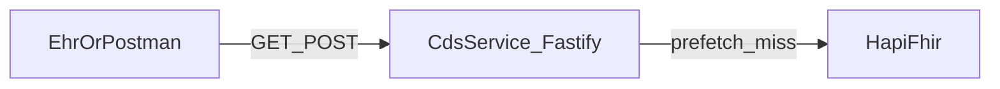

<!--
更新時間：2026-04-15 13:09
作者：CDS Service
摘要：工具與產出物補充 postman/CDS-Service-E2E.postman_collection.json

更新時間：2026-04-15 11:11
作者：CDS Service
摘要：已知限制補充連結 docs/cql_elm.md（CQL→ELM 編譯）

更新時間：2026-04-15 09:48
作者：CDS Service
摘要：E2E 完整測試計畫（由 Cursor 計畫匯出並改為相對路徑連結）
-->

# CDS Service E2E 完整測試計畫

## 範圍與目標

- **系統邊界**：EHR 模擬端（HTTP Client）→ **CDS Service**（[`src/server.ts`](../src/server.ts)、[`src/cds/routes.ts`](../src/cds/routes.ts)）→ **HAPI FHIR**（[`src/fhir/fhirClient.ts`](../src/fhir/fhirClient.ts)，`FHIR_BASE_URL`）。
- **成功準則**：Discovery 結構正確；Hook 在 Prefetch 有／無時皆能取得資料；回應 `cards` 符合 CDS Hooks 形狀；eGFR 規則觸發時出現 **warning** 卡並含 `links` / `source.url`（見 [`src/cds/ckdHookHandler.ts`](../src/cds/ckdHookHandler.ts)）；FHIR 異常時行為可預期（502 + OperationOutcome）。

---

## 前置條件（每輪測試前檢查）

| 項目 | 檢查方式 | 預期 |
|------|----------|------|
| Node 與依賴 | 專案根目錄 `npm install` 已完成 | 無錯誤 |
| 環境變數 | `.env` 或 shell：`FHIR_BASE_URL`、`CDS_PUBLIC_BASE_URL`、`PORT`、`CDS_GUIDELINE_URL`（可選） | 與實際 FHIR / CDS 位址一致 |
| HAPI FHIR | 瀏覽器或 `GET {FHIR_BASE_URL}/metadata` | 200 |
| CDS Service | `npm start` 後 `GET http://127.0.0.1:{PORT}/cds-services` | 200 |
| 測試病患資料 | 至少一筆已知 **Patient**（例：`patient-ckd-001`）及 **Observation** eGFR（LOINC `62238-1`）、Creatinine（`2160-0`） | 與 [`src/scripts/test-fhir-client.ts`](../src/scripts/test-fhir-client.ts) 能讀到一致結果 |

---

## 測試資料策略

- **固定案例 A（觸發複查）**：eGFR 數值 **&lt; 60**（與 [`cql/EGFR_Check.cql`](../cql/EGFR_Check.cql) / [`src/cql/egfrRecheckEvaluation.ts`](../src/cql/egfrRecheckEvaluation.ts) 一致）→ 預期 **2 張** `cards`（1×info + 1×warning）。
- **固定案例 B（不觸發）**：eGFR **≥ 60** 或無 eGFR → 預期 **1 張** info（或僅警告「尚無 eGFR」類訊息，依資料）。
- **Prefetch**：準備最小 **Bundle**（`latestEgfr`）與 **單一 Observation** 兩種，驗證 [`extractEGFRValue`](../src/cds/cdsServices.ts) 與 handler 路徑。

---

## E2E 測試案例（建議編號）

### 區塊 1：FHIR 連線層（獨立驗證）

| ID | 描述 | 步驟 | 預期結果 |
|----|------|------|----------|
| **TC-FHIR-01** | Patient 讀取 | `npm run test:fhir` | 主控台印出 Patient 姓名、eGFR、Creatinine；結束碼 0 |
| **TC-FHIR-02** | 手動查 FHIR | `GET {FHIR_BASE_URL}/Patient/{id}`、`GET .../Observation?patient={id}&code=62238-1` | 200，JSON 為 FHIR R4 |

### 區塊 2：Discovery

| ID | 描述 | 步驟 | 預期結果 |
|----|------|------|----------|
| **TC-DIS-01** | 服務清單 | `GET /cds-services`（Postman 或 `Invoke-RestMethod`） | JSON 含 `services` **長度 2** |
| **TC-DIS-02** | 服務 id / href | 檢查 `services[].id` | 含 `egfr-check`、`ckd-risk`；`href` 分別對應 `/cds-services/egfr-check`、`/cds-services/ckd-risk`（基底見 `CDS_PUBLIC_BASE_URL`） |
| **TC-DIS-03** | Prefetch 範本 | 檢查 `prefetch` | 含 `patient`、`latestEgfr`、`latestCreatinine`；字串含 `{{context.patientId}}` |

### 區塊 3：Hook — 無 Prefetch（Out-of-band）

| ID | 描述 | 步驟 | 預期結果 |
|----|------|------|----------|
| **TC-HOOK-01** | egfr-check 基本 | `POST /cds-services/egfr-check`，body：`hook`、`context.patientId`（案例 A） | HTTP **200**；`cards` 為陣列 |
| **TC-HOOK-02** | ckd-risk 相容 | 同 body `POST /cds-services/ckd-risk` | 與 TC-HOOK-01 **相同** `cards` 結構（邏輯共用 [`handleCkdRiskHook`](../src/cds/ckdHookHandler.ts)） |
| **TC-HOOK-03** | 複查規則（案例 A） | 案例 A 病患 | 至少 **2** 張卡：第一張 `indicator` 為 `info`；一張 `warning`；warning 含 `source.url`（`CDS_GUIDELINE_URL`）與 `links[0].url` 指向 `{FHIR_BASE_URL}/Observation?...62238-1` |
| **TC-HOOK-04** | 複查規則（案例 B） | 案例 B 病患 | **無** warning 卡（僅 info），或無 eGFR 時文案符合現行行為 |
| **TC-HOOK-05** | 缺 patientId | `POST` 省略 `context.patientId` | HTTP **200**；`cards` 含 **warning**「缺少 patientId」類訊息（見 handler） |

### 區塊 4：Hook — 含 Prefetch

| ID | 描述 | 步驟 | 預期結果 |
|----|------|------|----------|
| **TC-PF-01** | Bundle 型 `latestEgfr` | body 帶 `prefetch.latestEgfr` 為 `searchset` Bundle，entry[0] 為 Observation | 仍能得到 eGFR 行；`extractEGFRValue` 可解析數值時與 Observation 一致 |
| **TC-PF-02** | 僅 prefetch 數值路徑 | 模擬僅能解析數值、Observation 不完整 | 文案可能出現「來自 prefetch 數值」；複查判斷仍依 [`evaluateEgfrRecheck`](../src/cql/egfrRecheckEvaluation.ts) |

### 區塊 5：錯誤與韌性

| ID | 描述 | 步驟 | 預期結果 |
|----|------|------|----------|
| **TC-ERR-01** | FHIR 關閉 | 停 HAPI，`POST` hook（需 out-of-band） | HTTP **502**；body 為 `OperationOutcome` 形狀（見 [`postCdsHook`](../src/cds/routes.ts)） |
| **TC-ERR-02** | 錯誤 `FHIR_BASE_URL` | 指向不存在之 host，送 hook | **502** 或連線錯誤訊息於 diagnostics |
| **TC-ERR-03** | 不存在病患 | `patientId` 指向無資源之 ID | 依 FHIR 回應：可能 502（axios 經 [`handleFhirError`](../src/fhir/fhirClient.ts)）— 記錄實際 diagnostics |

### 區塊 6：迴歸與非功能（選做）

| ID | 描述 | 步驟 | 預期結果 |
|----|------|------|----------|
| **TC-NF-01** | 建置 | `npm run build` | 成功 |
| **TC-NF-02** | Postman Collection | 匯入 [`postman/CDS-Service.postman_collection.json`](../postman/CDS-Service.postman_collection.json) 或 [**CDS-Service-E2E**](../postman/CDS-Service-E2E.postman_collection.json)，跑 Discovery + POST／E2E 資料夾 | 與手動結果一致 |

---

## 執行順序建議

1. TC-FHIR-01 → TC-FHIR-02（確認資料層）。
2. TC-DIS-01～03（確認「名片」）。
3. TC-HOOK-01～05（主路徑 + 缺欄）。
4. TC-PF-01～02（Prefetch）。
5. TC-ERR-01～03（錯誤）。
6. TC-NF-01～02（迴歸／工具）。

---

## 工具與產出物

- **Postman**：[`postman/CDS-Service.postman_collection.json`](../postman/CDS-Service.postman_collection.json)（Discovery + 基本 Hook）；[**CDS-Service-E2E**](../postman/CDS-Service-E2E.postman_collection.json)（**TC-HOOK～TC-ERR** 對應請求，變數含 `patientIdCaseA`／`patientIdCaseB` 等）。
- **PowerShell**：`Invoke-RestMethod`；建議對回應使用 `ConvertTo-Json -Depth 10` 避免表格截斷。
- **測試紀錄**：每案例記錄日期、環境、`FHIR_BASE_URL`、病患 ID、HTTP 狀態、擷取 `cards` JSON 摘要、Pass/Fail。

---

## 已知限制（測試計畫需註記）

- **CQL 執行**：目前為 TS 對齊層（[`src/cql/egfrRecheckEvaluation.ts`](../src/cql/egfrRecheckEvaluation.ts)），非 `cql-execution` 執行 ELM；若未來改引擎，需新增 **TC-CQL-ELM-xx**（同一病患資料下對照輸出）。ELM 編譯與產物路徑見 [`docs/cql_elm.md`](cql_elm.md)。

---

## 追蹤清單（執行測試時勾選）

- [ ] 建立測試環境檢核表（Node、.env、HAPI、CDS 啟動、測試病患 A/B）
- [ ] 執行 TC-FHIR-01/02 與手動 FHIR GET 確認資料存在
- [ ] 執行 TC-DIS-01～03，驗證 egfr-check / ckd-risk 與 prefetch 範本
- [ ] 執行 TC-HOOK-01～05（含案例 A/B、缺 patientId）
- [ ] 執行 TC-PF-01～02（Bundle / 數值路徑）
- [ ] 執行 TC-ERR-01～03（FHIR 關閉、錯誤 base、無病患）
- [ ] 執行 TC-NF-01～02 與測試紀錄彙整
