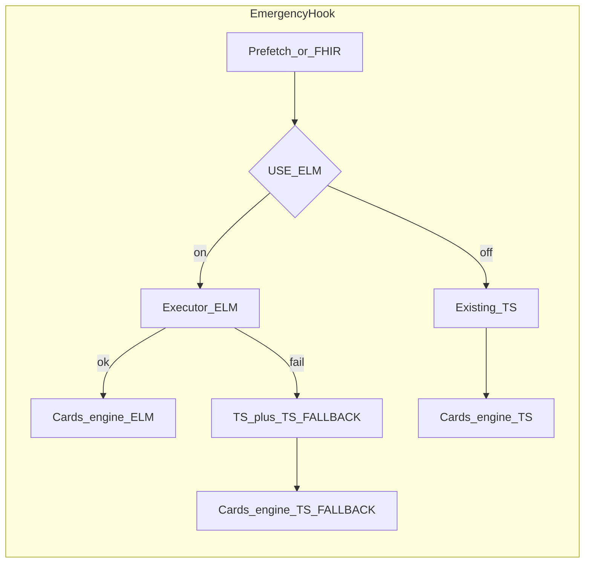

<!--
更新時間：2026-04-20 14:17
作者：CDS Service
摘要：自 Cursor 計畫檔保存至 docs/emergence；依 Phase B 已落地成果更新 todos status
-->

---
name: Phase B 急診 ELM
overview: 在 ECR 已核准且 hi_level_design.md（及院內詳設）更新完成後，為兩支急診 hook 新增 CQL／ELM 與 executor；急診與主 CDS **共用**環境變數 `USE_ELM`（沿用 `getUseElm()`），ELM 失敗時 `TS_FALLBACK` 與現有 CKD 模式一致；驗證以 case-08／09 為準。
todos:
  - id: b0-ecr-design
    content: 確認 ECR 核准與 hi_level_design（及院內詳設）已更新；ELM 開關已鎖定為共用 USE_ELM（getUseElm）；確認 cards extension（rule-engine）策略
    status: completed
  - id: b1-cql-infection
    content: 撰寫 cql/Infection_Control_Warning.cql（FHIR 4.0.1 + FHIRHelpers、parameter SkipFlags、define 與 TS 對齊）
    status: completed
  - id: b2-cql-72hr
    content: 撰寫 cql/Emergency_72h_Revisit.cql（parameter Now／WindowHours／MinEncounters／ClassCodes、Encounter 窗內計數與無 id 語意）
    status: completed
  - id: b3-compile-elm
    content: 以 Maven cql-to-elm-cli 產出 elm/Infection_Control_Warning.json、elm/Emergency_72h_Revisit.json 並納入版控
    status: completed
  - id: b4-executor-infection
    content: 新增 src/cql/emergencyInfectionControlElmExecutor.ts（Repository + PatientSource + 結果對應）
    status: completed
  - id: b5-executor-72hr
    content: 新增 src/cql/emergency72hRevisitElmExecutor.ts（參數注入與結果對應）
    status: completed
  - id: b6-handlers
    content: 改 infectionControlHookHandler／revisit72hHookHandler：ELM 分支、TS_FALLBACK、urn:cds-service:rule-engine；必要時抽 TS 評估函式
    status: completed
  - id: b7-env-docs
    content: 更新 dev_readme、cql_elm.md、infection_control_warning_rules 現況、agent_session_summary；.env.example 僅補充 USE_ELM 語意（與急診共用，不新增鍵名）
    status: completed
  - id: b8-verify-cases
    content: 以 Postman／手動驗證 case-08／09／09-1 在 ELM on/off 與人為 ELM 失敗時之 parity
    status: pending
isProject: false
---

# Phase B：急診雙服務 CQL／ELM 實作詳盡計畫

## 0. 前置閘門（未完成則停止實作）

- **ECR**：已依 `[docs/emergence/ecr-template.md](docs/emergence/ecr-template.md)` 填寫、送核並取得**書面核准**（範圍含兩服務、SSOT、旗標策略、測試與回滾）。
- **設計文件**：`[hi_level_design.md](hi_level_design.md)` 已增修「急診 CDS／CQL 邊界、資料契約、環境變數、與主程式 `USE_ELM` 關係」；院內詳細設計若有，已同步版次。
- **臨床對齊**：`[docs/emergence/infection_control_warning_rules.md](docs/emergence/infection_control_warning_rules.md)` 與 `[docs/急診檢傷+臨床決策系統.pdf](docs/急診檢傷+臨床決策系統.pdf)` 無未解決矛盾（若矛盾須回到 ECR）。

---

## 1. 架構決策（已鎖定／須寫入 ECR 與 hi_level_design）

| 議題       | 決策                                                        | 說明                                                                                                                                                                                                              |
| -------- | --------------------------------------------------------- | --------------------------------------------------------------------------------------------------------------------------------------------------------------------------------------------------------------- |
| ELM 開關   | **僅共用 `USE_ELM`**                                         | 與主 CDS 相同環境變數；急診 handler 呼叫既有 `[getUseElm()](src/cds/utils.ts)`。**不**新增 `USE_ELM_EMERGENCY` 或 `getUseElmEmergency()`。`USE_ELM=true` 時，主程式（port 3000）與急診程式（port 3001）各自若讀到該環境變數，則**各自**啟用對應 ELM；文件需明示此「一鍵多程序」行為。 |
| 規則檔拆分    | **兩個 CQL library** ↔ **兩個 ELM JSON**                      | 與兩支 hook 一一對應：`Infection_Control_Warning`／`Emergency_72h_Revisit`（library 名與檔名對齊 CQFramework）。                                                                                                                  |
| 執行期資料    | **Collection Bundle + `PatientSource.FHIRv401()`**        | 與 `[src/cql/ckdRiskElmExecutor.ts](src/cql/ckdRiskElmExecutor.ts)` 相同模式。                                                                                                                                        |
| Fallback | **try ELM → catch → 現有 TS 路徑**                            | 對齊 `[src/cds/ckdHookHandler.ts](src/cds/ckdHookHandler.ts)`（約 324–341 行）之 `engine`：`ELM`                                                                                                                        |
| Cards 標記 | `**urn:cds-service:rule-engine`**（`valueString` = engine） | 主 CDS 已用（如 `[egfrCheckHookHandler.ts](src/cds/egfrCheckHookHandler.ts)`）；急診現有 `urn:cds:emergency:rule` **保留**，並**加** `urn:cds-service:rule-engine` 以利 QA／E2E。                                                   |

---

## 2. CQL 設計要點（實作前寫入設計 md 的「運算契約」）

### 2.1 共通技術約定

- **語言／模型**：與 `[cql/CKD_Risk.cql](cql/CKD_Risk.cql)` 相同：`library … version '1.0.0'`、`using FHIR version '4.0.1'`、`include FHIRHelpers version '4.1.0'`、`context Patient`。
- **FHIRHelpers**：執行期 `[elm/FHIRHelpers.json](elm/FHIRHelpers.json)` 已存在；`Repository` 須同時註冊 **本庫 + FHIRHelpers**（見 `ckdRiskElmExecutor`）。
- **可測參數**（建議以 CQL `parameter` 表達，與 TS 環境變數對齊）：
  - 感控：`SkipFlags`（Boolean，對應 `EMERGENCY_INFECT_CTRL_SKIP_FLAGS`）。
  - 72hr：`WindowHours`、`MinEncounters`（Integer）、`ClassCodes`（字串清單，可空）、`**Now`**（`System.DateTime`，與 `[infection_control_warning_rules.md](docs/emergence/infection_control_warning_rules.md)` 所述 TS／CQL 對齊議題一致；executor 由 handler 傳入與 `new Date()` 相同語意之即時）。

### 2.2 `Infection_Control_Warning`（對齊 TS）

- **輸入資源**：`Patient`、`Flag`、`MedicationStatement`、`Condition`（與現有 hybrid 取數一致；CQL 以 `[Flag]`、`[MedicationStatement]`、`[Condition]` retrieve，或僅依 bundle 內容）。
- **建議輸出 define**（名稱於設計 md 鎖定後不可任意改，需與 executor 對應）：例如 `HasAlert: Boolean`、`ReasonFlagsCount: Integer`、或細項 Boolean 供卡片組裝。目標：**在 `getUseElm()` 為真時**，ELM 輸出與 TS 對 case-09／09-1 之 warning／info **一致**（門檻語意以 TS 為 golden，除非 ECR 明訂改臨床）。

### 2.3 `Emergency_72h_Revisit`（對齊 TS）

- **輸入資源**：`Patient`、`Encounter`（來自 prefetch 或補位查詢之一致集合；設計中訂明「最多 N 筆」與 TS `count: 50` 對齊）。
- **輸出 define**：例如 `CountInWindow: Integer`、`MeetsThreshold: Boolean`（或僅 `MeetsThreshold` + `CountInWindow` 供 extension 字串）。
- **邊界**：無 `Encounter.id` 時不去重—CQL 須與 TS `[countEncountersStartingInWindow](src/emergency/handlers/revisit72hHookHandler.ts)` 等價。

---

## 3. CQL → ELM 編譯與產物

- **指令**：沿用 `[docs/cql_elm.md](docs/cql_elm.md)` 之 Maven 方式（`[scripts/cql-compile-pom.xml](scripts/cql-compile-pom.xml)`），於 repo 根執行 `exec:java`，`--input`／`--output` 各指向新檔，例如：
  - `cql/Infection_Control_Warning.cql` → `elm/Infection_Control_Warning.json`
  - `cql/Emergency_72h_Revisit.cql` → `elm/Emergency_72h_Revisit.json`
- **納入版控**：ELM JSON 與 CQL 一併 commit（與既有 `elm/CKD_Risk.json` 一致）。
- **驗證**：編譯無 **error**；warning 依 `[docs/cql_elm.md](docs/cql_elm.md)`／`[docs/qa/README.md](docs/qa/README.md)` 判讀是否可接受。

---

## 4. TypeScript 實作步驟（建議順序）

1. `**src/cds/utils.ts`**：無需新增函數；急診 handler 自 `../../cds/utils.js` 匯入並呼叫既有 `**getUseElm()`** 即可（與主 CDS 同源判斷）。
2. **新建 executor**（建議兩檔，對齊 `ckdRiskElmExecutor`）：
  - `src/cql/emergencyInfectionControlElmExecutor.ts`：輸入型別 = 感控 prefetch 合併後之 `patient`、`flags[]`、`medicationStatements[]`、`conditions[]`；組 bundle；`lib.resolve('Infection_Control_Warning','1.0.0')`；回傳結構化結果。
  - `src/cql/emergency72hRevisitElmExecutor.ts`：`patient`、`encounters[]` + **parameter 注入**（`Now`、`WindowHours`、`MinEncounters`、`ClassCodes`）。
3. **重構或包裝現有 TS 決策**（降低 handler 膨脹）：
  - 將 `infectionControlHookHandler`／`revisit72hHookHandler` 內「純計算」抽成 `evaluateXxxWithTs(...)`（可新檔 `src/emergency/evaluation/…` 或同目錄），handler 只負責：解析 patientId、hybrid 取數、`engine` 分支、組 cards。
4. **Handler 整合**：
  - `const useElm = getUseElm()` 為真：`try { evaluateWithElm(...) } catch { engine='TS_FALLBACK'; evaluateWithTs(...) }`。
  - 為每張 card 加上 `**urn:cds-service:rule-engine`**（與既有急診 extension 並存）。
5. `**.env.example` 與 `[dev_readme.md](dev_readme.md)`**：不重複新增環境變數鍵名；補充說明 `**USE_ELM=true` 同時影響主 CDS 與急診**（兩程序皆讀同一變數時之行為）、驗收時建議分別對 3000／3001 測試。

---

## 5. 測試與驗收矩陣

| 案例                  | `USE_ELM`（或急診旗標） | 預期                                           |
| ------------------- | ---------------- | -------------------------------------------- |
| case-08             | false            | 與現行 TS 相同（warning／info 依資料）                  |
| case-08             | true             | ELM 結果與 TS parity；人為可查 `rule-engine` = `ELM` |
| ELM 人為損毀 json／throw | true             | 仍回卡片、`rule-engine` = `TS_FALLBACK`、行為與 TS 一致 |
| case-09、case-09-1   | false／true       | 同上                                           |

**測試策略**：專案若仍無 vitest，可優先 **手動 Postman** + 可選 **小腳本** 呼叫 handler（mock FHIR 屬測試專案，須遵守「測試不混入正式程式」規則—mock 僅在測試檔或腳本內）。

---

## 6. 文件與交付物

- 更新 `[docs/cql_elm.md](docs/cql_elm.md)`：新增兩支急診 CQL 的編譯範例行。
- 更新 `[docs/emergence/infection_control_warning_rules.md](docs/emergence/infection_control_warning_rules.md)`：「現況」改為已具 ELM 檔與開關行為（置頂歷史註解）。
- `[dev_readme.md](dev_readme.md)`：時間戳 + 急診 ELM 說明。
- `[docs/emergence/agent_session_summary.md](docs/emergence/agent_session_summary.md)`：簡要紀錄 Phase B 完成項。

---

## 7. 回滾

- 環境變數設回 `false` 即 100% 回到現行 TS（與 CKD 模式一致）。
- Git revert 僅作為最後手段；以 ECR 附件之「還原檔案清單」為準。

---

## 8. 主要風險與緩解

| 風險                                   | 緩解                                                                      |
| ------------------------------------ | ----------------------------------------------------------------------- |
| CQL 與 TS 微差（ICD／ATC 邊界、`Now` 時區）     | 以 case-08／09 為 golden；設計 md 寫明正規化與評估時刻                                  |
| `cql-exec-fhir` 對部分 FHIR 路徑不支援       | 早於 executor 內試跑；不足處改 CQL 取欄或 bundle 形狀                                  |
| 單一 `USE_ELM` 同時打開主與急診 ELM（非誤傷，為刻意共用） | `dev_readme`／ECR 明示；本機驗收時分別對 `npm start` 與 `npm run start:emergency` 驗證 |

