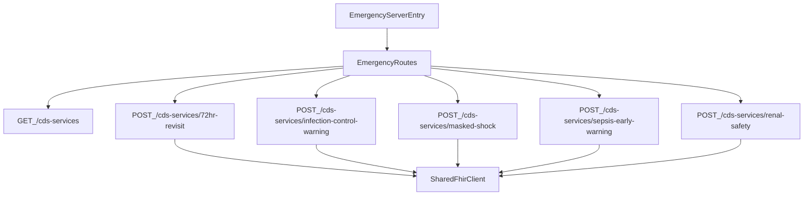

<!--
更新時間：2026-04-17 10:14
作者：CDS Service
摘要：自 Cursor 規劃檔同步至 repo，供急診 CDS server follow-up（來源：`.cursor/plans/新cds_server研究規劃_1ff52375.plan.md`）
-->

---
name: 新CDS Server研究規劃
overview: 唯讀分析 `docs/急診檢傷+臨床決策系統.pdf` 與現有專案結構，確認在本專案中建立新 CDS server 的實際落地方式、最小實作清單、風險與待確認事項，先產出計畫不執行修改。
todos:
  - id: analyze-pdf-hooks
    content: 整理 PDF 中與 patient-view、observation-create、order-select 相關的需求、輸入輸出與觸發點
    status: pending
  - id: map-current-architecture
    content: 對照現有專案的 server、routes、service definitions、handlers、FHIR client 與文件，整理可複用模式
    status: pending
  - id: compare-implementation-options
    content: 比對『獨立新 server』與『既有 server 內新增 service』兩種做法的差異、風險與建議
    status: pending
  - id: draft-execution-plan
    content: 產出最小實作清單、需新增/修改檔案、接線流程與建議實作順序
    status: pending
isProject: false
---

# 新 CDS Server 研究與實作規劃

## 目標

以唯讀方式完成研究，回答「如何在此專案中建立一個新的 CDS server」，並在不修改任何檔案的前提下，產出可執行的實作計畫。

## 目前已確認的核心前提

- 現有專案的實際架構是「單一 Fastify CDS server + 多個 CDS Hooks services」，不是多個獨立 server process。
- 啟動入口集中在 `[c:\Development\HISCore\CDS Service\src\server.ts](c:\Development\HISCore\CDS Service\src\server.ts)`，由 `registerCdsRoutes(app)` 掛上 discovery 與各 service route。
- service discovery 與 POST endpoint 目前是手動維護，核心接線位於 `[c:\Development\HISCore\CDS Service\src\cds\routes.ts](c:\Development\HISCore\CDS Service\src\cds\routes.ts)`、`[c:\Development\HISCore\CDS Service\src\cds\cdsServices.ts](c:\Development\HISCore\CDS Service\src\cds\cdsServices.ts)`、`[c:\Development\HISCore\CDS Service\src\cds\ckdServiceDefinition.ts](c:\Development\HISCore\CDS Service\src\cds\ckdServiceDefinition.ts)`。
- 因此「建立新的 CDS server」在此專案中較可能等價於：在既有 server 內新增一個新的 CDS Hooks service；若真要建立第二個獨立 server，將屬於架構變更，超出目前既有模式，需先做 ECR。

## PDF 與專案對照後的分析方向

### PDF 可對應的 Hook 類型

- `patient-view`
- `observation-create`
- `order-select`

### PDF 提出的代表情境

- 72 小時內高風險重複返診：偏向 `Encounter` 查詢與 `patient-view`
- 特殊列管個案感控預警：偏向 `Flag`、`MedicationStatement`、`Condition` 與 `patient-view`
- 藥物掩蓋生理假象：偏向 `MedicationRequest` + 即時觀測值，屬 `observation-create`
- 疑似敗血症早期預警：偏向 `Condition` + 即時觀測值，屬 `observation-create`
- 腎功能不全下的醫令安全：偏向 `Observation` + selected order，屬 `order-select`

### 與現有實作的主要差異

- 現有 3 個 services 都是 `patient-view`，尚未看見 `observation-create` 或 `order-select` 的現成 route/definition 範例。
- 現有 service 主要依賴 `Patient`、`Condition`、`Observation`、`FamilyMemberHistory`；PDF 還需要 `Encounter`、`Flag`、`MedicationStatement`、`MedicationRequest` 等新資料來源。
- 現有 handler 模式支援 `prefetch 優先 + FHIR fallback`，這一點可直接複用。

## 既有可複用模式

### 最小模板

- 以 `[c:\Development\HISCore\CDS Service\src\cds\cdsServices.ts](c:\Development\HISCore\CDS Service\src\cds\cdsServices.ts)` 的 `egfr-check` 為最小 service definition 模板。
- 以 `[c:\Development\HISCore\CDS Service\src\cds\egfrCheckHookHandler.ts](c:\Development\HISCore\CDS Service\src\cds\egfrCheckHookHandler.ts)` 為最小 handler 模板。

### 進階模板

- 以 `[c:\Development\HISCore\CDS Service\src\cds\ckdHookHandler.ts](c:\Development\HISCore\CDS Service\src\cds\ckdHookHandler.ts)` 作為 `prefetch + FHIR fallback + card builder` 的 hybrid 參考。
- 以 `[c:\Development\HISCore\CDS Service\src\cds\ckdComprehensiveHookHandler.ts](c:\Development\HISCore\CDS Service\src\cds\ckdComprehensiveHookHandler.ts)` 作為多規則整合範例。

### 啟動與設定模板

- 由 `[c:\Development\HISCore\CDS Service\src\server.ts](c:\Development\HISCore\CDS Service\src\server.ts)` 啟動。
- 由 `[c:\Development\HISCore\CDS Service\package.json](c:\Development\HISCore\CDS Service\package.json)` 中的 `dev`、`start`、`build` 腳本啟動與建置。
- 由 `[c:\Development\HISCore\CDS Service\.env.example](c:\Development\HISCore\CDS Service\.env.example)` 提供 `FHIR_BASE_URL`、`CDS_PUBLIC_BASE_URL`、`USE_ELM` 等必要設定。

## 建議的最小實作清單

若後續採「在既有 server 內新增新 service」：

- 新增 1 個 service definition 檔案，或在既有 definition 檔中加入新 service metadata。
- 新增 1 個 hook handler 檔案，實作 request 解析、prefetch 解析、FHIR fallback、規則執行與 cards 回傳。
- 修改 `[c:\Development\HISCore\CDS Service\src\cds\routes.ts](c:\Development\HISCore\CDS Service\src\cds\routes.ts)`，把新 service 加入 `GET /cds-services` 與 `POST /cds-services/{id}`。
- 視規則需要，擴充 `[c:\Development\HISCore\CDS Service\src\fhir\fhirClient.ts](c:\Development\HISCore\CDS Service\src\fhir\fhirClient.ts)` 的 FHIR 查詢方法。
- 若規則以 CQL 為單一真理來源，新增對應 `cql/*.cql`、必要時新增 `elm/*.json` 與對應 executor。
- 補齊呼叫樣本與文件，例如 Postman collection、hook request JSON、設計說明。

## 方案對比

### 方案 A：完全依照 PDF 建立獨立「新 CDS server」

- 作法：新增第二個 server 入口、第二套路由註冊、第二組 discovery/handlers。
- 優點：可與急診檢傷情境清楚分開。
- 風險：與現有單一 server 架構不一致，部署、路由、設定與維運複雜度上升；現有專案沒有這種模板。
- 建議：若沒有明確的部署隔離需求，不建議直接採用。

#### 方案 A 的具體架構

- 目標型態：在同一個 repository 內建立「第二個獨立執行中的 CDS server」，而不是只在既有 `src/server.ts` 內多掛一個 service。
- 邊界切分：
  - 既有 server 繼續承載目前 CKD 相關 services。
  - 新 server 專責承載 PDF 中急診檢傷相關 services，例如 `72hr-revisit`、`infection-control-warning`、`masked-shock`、`sepsis-early-warning`、`renal-safety`。
- 共用原則：
  - 可共用 `src/fhir/fhirClient.ts` 的 HTTP/FHIR 查詢能力。
  - 可共用既有 `CdsHooksRequest` / `CdsHooksResponse` 型別模式。
  - 可共用未來 CQL/ELM 執行模式，但 discovery、routes、handler 清單、啟動入口要獨立。

#### 方案 A 建議的檔案層級切分

- 新增獨立 server 入口：
  - `[c:\Development\HISCore\CDS Service\src\emergency\server.ts](c:\Development\HISCore\CDS Service\src\emergency\server.ts)`
  - 用途：建立 Fastify app，註冊急診專屬 CDS routes，監聽獨立 port。
- 新增急診專屬 routes：
  - `[c:\Development\HISCore\CDS Service\src\emergency\routes.ts](c:\Development\HISCore\CDS Service\src\emergency\routes.ts)`
  - 用途：註冊 `GET /cds-services` 與該 server 底下所有 `POST /cds-services/{serviceId}`。
- 新增急診 service definitions：
  - `[c:\Development\HISCore\CDS Service\src\emergency\serviceDefinitions.ts](c:\Development\HISCore\CDS Service\src\emergency\serviceDefinitions.ts)`
  - 用途：集中定義急診服務的 `id`、`hook`、`href`、`prefetch`。
- 每個情境建立專屬 handler：
  - `[c:\Development\HISCore\CDS Service\src\emergency\handlers\*.ts](c:\Development\HISCore\CDS Service\src\emergency\handlers\*.ts)`
  - 用途：各情境分別處理 request、prefetch、FHIR fallback、rule evaluation、cards 組裝。
- 視需要新增急診專屬 card builder：
  - `[c:\Development\HISCore\CDS Service\src\emergency\cards\*.ts](c:\Development\HISCore\CDS Service\src\emergency\cards\*.ts)`
  - 用途：把警示卡樣式、連結、建議動作與隱私顯示策略獨立封裝。
- 視需要新增急診專屬 CQL / ELM：
  - `[c:\Development\HISCore\CDS Service\cql\emergency\*.cql](c:\Development\HISCore\CDS Service\cql\emergency\*.cql)`
  - `[c:\Development\HISCore\CDS Service\elm\emergency\*.json](c:\Development\HISCore\CDS Service\elm\emergency\*.json)`
  - 用途：將急診規則與既有 CKD 規則分域管理。

#### 方案 A 的啟動與註冊流程

1. 新增急診專屬入口 `src/emergency/server.ts`。
2. 入口內建立 Fastify instance。
3. 呼叫 `registerEmergencyCdsRoutes(app)`。
4. `src/emergency/routes.ts` 註冊急診專屬 `GET /cds-services`。
5. 同檔註冊多個急診專屬 `POST /cds-services/{serviceId}`。
6. EHR 或前端需改連到急診專屬 server 的 base URL，而不是既有 CKD server。

#### 方案 A 的設定拆分建議

- 既有 `.env.example` 只覆蓋單一 server；若採方案 A，建議新增急診專屬設定，例如：
  - `EMERGENCY_CDS_PORT`
  - `EMERGENCY_CDS_HOST`
  - `EMERGENCY_CDS_PUBLIC_BASE_URL`
  - 若要接不同 FHIR 來源，才額外考慮 `EMERGENCY_FHIR_BASE_URL`
- `package.json` 需增加獨立啟動腳本，例如：
  - `dev:emergency`
  - `start:emergency`
- 前端或測試工具也要增加第二個 proxy / collection，否則仍只會打到既有 server。

#### 方案 A 的資料來源擴充清單

- 現有 `[c:\Development\HISCore\CDS Service\src\fhir\fhirClient.ts](c:\Development\HISCore\CDS Service\src\fhir\fhirClient.ts)` 已涵蓋：
  - `Patient`
  - `Observation`
  - `Condition`
  - `FamilyMemberHistory`
- 但 PDF 案例若要完整落地，方案 A 至少還要補：
  - `Encounter`：支援 72 小時返診檢查
  - `Flag`：支援特殊列管/感控標記
  - `MedicationStatement`：支援 TB/HIV 用藥線索
  - `MedicationRequest`：支援 Beta-blocker 藥令比對
- 也就是說，方案 A 雖然 server 可獨立，但底層 FHIR client 仍可能要擴充共用能力。

#### 方案 A 的實作順序建議

1. 先建立急診專屬 `server.ts` 與 `routes.ts`，只掛 discovery，確認第二個 server 可獨立啟動。
2. 優先落地一個 `patient-view` 案例，建議從 `72hr-revisit` 或 `infection-control-warning` 開始，因為最接近現有模式。
3. 再擴充 `observation-create` 類型，例如 `masked-shock` 或 `sepsis-early-warning`。
4. 最後再補 `order-select` 的 `renal-safety`，因為它還需要確認前端傳入 selected order 的格式。
5. 補齊 Postman / 文件 / 測試資料，讓兩個 server 都能被獨立驗證。

#### 方案 A 的主要風險再細化

- 架構風險：
  - repository 內會同時存在兩個 server 入口，若共用模組邊界沒有先定義清楚，容易出現重複實作。
- 設定風險：
  - 目前 `.env` 與 `package.json` 以單一 server 為前提，若直接擴充而不做命名隔離，容易互相覆蓋設定。
- 對接風險：
  - 既有前端 proxy 與 Postman collection 預設只指向單一 `/cds-services` base，後續若不拆分，驗證流程會混淆。
- 規格風險：
  - 現有專案尚未出現 `observation-create` / `order-select` 的 request 範本，這兩類 hook 的 request shape 仍需標記為 `待確認`。
- 維運風險：
  - 部署、監控、健康檢查、port 管理與文件都要雙份維護。

### 方案 B：比照現有專案模式，在既有 server 內新增一個或多個 service

- 作法：沿用現有 Fastify server，在 `routes.ts` 註冊新 service，依 PDF 情境決定 hook type 與 prefetch。
- 優點：最符合現有程式碼、最小變更、風險最低。
- 風險：若 PDF 最終需要不同 domain、不同啟動生命週期或不同對外網址，後續仍可能需要再拆分。
- 建議：優先採用，除非使用者明確要求獨立程序/獨立部署。

## 待確認事項

- 「新 CDS server」是否真的是指新的獨立 process，而不是既有 server 內的新 service。
- PDF 的 5 個案例，後續要一次實作全部，還是先選 1 個情境做第一個 service。
- 若第一波要從 PDF 選 1 個案例，是否優先從與現有模式最接近的 `patient-view` 類型開始。
- `observation-create` 與 `order-select` 是否有前端或 EHR 端既定 request 格式可供對接，目前在專案中尚未見到現成範例。

## 預計輸出

研究完成後，回覆內容將依下列章節整理：

- `## 1. PDF 重點摘要`
- `## 2. 現有專案對應結構`
- `## 3. 建立新 CDS server 的建議做法`
- `## 4. 需新增/修改的檔案清單`
- `## 5. 風險與待確認事項`
- `## 6. 建議的實作順序`
