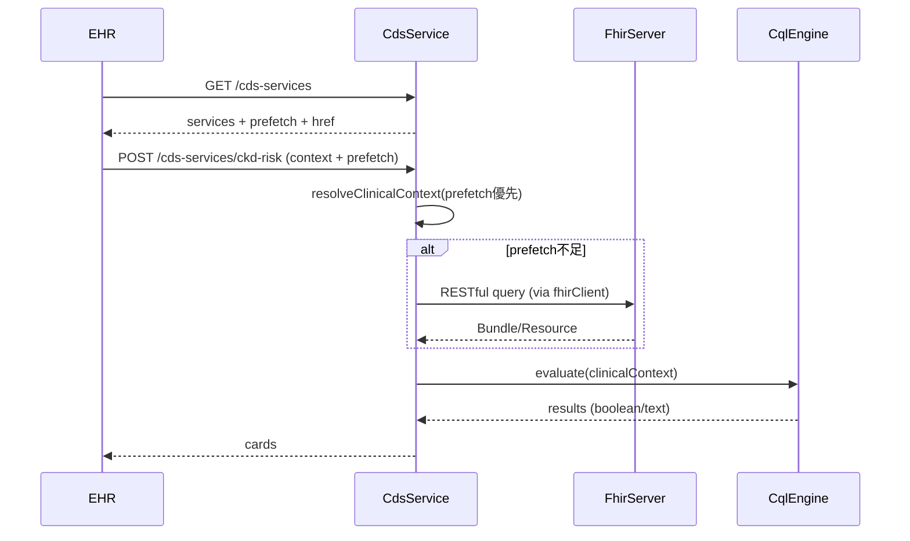

<!--
更新時間：2026-04-15 11:11
作者：CDS Service
摘要：補充 docs/cql_elm.md 連結（CQL→ELM 編譯文件）

更新時間：2026-04-15 09:43
作者：CDS Service
摘要：階段四 — CDS Service 以 Fastify 實作（等同 Express）；複查卡含 links / source.url

更新時間：2026-04-15 09:32
作者：CDS Service
摘要：階段三 — 新增 cql/EGFR_Check.cql 與 src/cql/egfrRecheckEvaluation.ts（TS 對齊層）；修正文件內誤植的 \\n

更新時間：2026-04-15 09:09
作者：CDS Service
摘要：步驟二 — 補充 Discovery（egfr-check + ckd-risk）、`cdsServices.ts` 與 `extractEGFRValue`

更新時間：2026-04-14 17:10
作者：CDS Service
摘要：新增階段一架構設計文件（CDS Hooks / FHIR / CQL），並對照目前實作與 fhirClient 整合邊界
-->

## 階段一：架構設計（與 `fhirClient` 整合）

本文件描述目前 CDS Service 的事件驅動架構、與 FHIR R4 的資料取得策略（Prefetch + Out-of-band Query），以及後續導入 CQL 引擎時的模組邊界。

### 目標（Why）

- **解耦**：將「資料取得 / 正規化」與「臨床邏輯（CQL）」分離，避免把規則硬寫在 hook handler 裡。
- **穩定性**：當 FHIR Server 回應異常（OperationOutcome、404、逾時、網路中斷）時，CDS Service 可用一致方式處理與回報。
- **可演進**：先讓 Discovery + Hook 跑通，再接上 CQL 引擎（階段二），不需要回頭大改路由與資料流。

### 系統元件與責任

| 元件 | 責任 | 本專案對應 |
|------|------|------------|
| **EHR（CDS Client）** | 讀取 Discovery、觸發 Hook、選擇性 prefetch、呼叫 Service Endpoint | 測試可用 PowerShell / Postman；正式環境由 EHR 提供 |
| **CDS Service** | 提供 `GET /cds-services`、處理 `POST /cds-services/{id}`，準備 FHIR 資料並產生 cards | `src/server.ts`、`src/cds/*` |
| **FHIR Server（HAPI）** | 病歷資料權威來源（FHIR R4） | `FHIR_BASE_URL` 指向的服務 |
| **CQL（階段三）** | 臨床規則以 `cql/*.cql` 為準；執行層可先以 TS 對齊，再換成 ELM/CQL 引擎 | `cql/EGFR_Check.cql`、`src/cql/egfrRecheckEvaluation.ts` |

### 現有 API（對照程式碼）

- **Discovery Endpoint**：`GET /cds-services`  
  - 實作：`src/cds/routes.ts`（合併多筆 `services`）  
  - **步驟二**：`src/cds/cdsServices.ts` 定義 `egfr-check`（`id=egfr-check`，`href` → `/cds-services/egfr-check`，`prefetch` 範本使用 `{{context.patientId}}`）  
  - **相容**：`src/cds/ckdServiceDefinition.ts` 仍提供 `ckd-risk`（`href` → `/cds-services/ckd-risk`）
- **Service Endpoint**  
  - `POST /cds-services/egfr-check`（步驟二主路徑）  
  - `POST /cds-services/ckd-risk`（與前者共用 handler，保留舊整合）  
  - 實作：`src/cds/routes.ts` → `src/cds/ckdHookHandler.ts`；Prefetch 輔助 `extractEGFRValue` 於 `src/cds/cdsServices.ts`

### FHIR 資料流（Prefetch vs Out-of-band）

CDS Service 取得病患資料有兩條路：

- **Prefetch（預取）**：EHR 依 Discovery 回傳的 `prefetch` 範本，把資料包在請求內送來。  
  - 優點：減少額外 FHIR round-trip、延遲低。  
  - 風險：EHR 可能不支援、或只提供部分資料。

- **Out-of-band Query（主動查詢）**：當 prefetch 不足時，CDS Service 主動呼叫 FHIR Server REST API 取回資料。  
  - 本專案由 `src/fhir/fhirClient.ts` 實作（axios + timeout + OperationOutcome 解析）。  
  - 未來若 EHR 提供 access token（`fhirAuthorization`），可擴充 `fhirClient` 自動附帶 `Authorization: Bearer ...`。

### 呼叫順序（事件驅動）

### 與 `fhirClient` 的整合邊界（階段一要定義清楚）

#### 1) 資料準備層（Resolver）

**職責**：將 CDS Hooks Request 的 `context` / `prefetch` 轉成「邏輯可用」的 FHIR resource（或後續 CQL 需要的 named resources）。  

- **輸入**：`CdsHooksRequest`（至少包含 `context.patientId`，prefetch 可選）  
- **輸出（以 CKD hook 為例）**：  
  - `patient: Patient`（或 `Record<string, unknown>`）  
  - `latestEgfr: Observation | null`  
  - `latestCreatinine: Observation | null`

**策略**：prefetch 優先 → 不足才呼叫 `fhirClient`：  

- `patient`：prefetch `patient` → `getPatient(patientId)`  
- `latestEgfr`：prefetch `latestEgfr` → `getLatestEGFR(patientId)`  
- `latestCreatinine`：prefetch `latestCreatinine` → `getLatestCreatinine(patientId)`

#### 2) CQL 評估層（階段三：目前已落地「TS 對齊層」）

**職責**：只接收 resolver 的輸出，不直接碰 HTTP/prefetch/fhirClient。

- **規則來源（Single Source of Truth）**：[`cql/EGFR_Check.cql`](cql/EGFR_Check.cql)（`Needs Recheck`：最新 eGFR &lt; 60 `mL/min/1.73m2`）。
- **執行（目前）**：[`src/cql/egfrRecheckEvaluation.ts`](src/cql/egfrRecheckEvaluation.ts) 以 TypeScript 實作與上述 CQL **等價**的門檻判斷與建議文字，供 `ckdHookHandler` 產生第二張 **warning** 卡片。
- **執行（下一階段）**：改以 **CQL→ELM** 編譯後由 **CQL 引擎**執行，避免 TS 與 CQL 長期雙軌不一致。編譯步驟見 [`docs/cql_elm.md`](docs/cql_elm.md)。

落地方式（擇一）：

- **方案 A：Node 內嵌 CQL/ELM 執行**：部署簡單，需評估套件成熟度與 CQL 覆蓋度。
- **方案 B：外掛 JVM CQL 引擎（子程序或服務）**：相容性通常較佳，但部署、效能與維運成本較高。

### 錯誤處理原則

- **FHIR 錯誤**：在 `fhirClient` 統一解析 OperationOutcome 並轉成可讀錯誤訊息。
- **Service 端點錯誤**：目前 `POST /cds-services/ckd-risk` 出錯時回 `502`，body 為簡化 OperationOutcome（之後可再細分 4xx/5xx）。

### 下一階段預告

- 導入 **CQL/ELM 引擎**執行 `cql/EGFR_Check.cql`（取代 TS 對齊層或並行驗證）。
- 新增 `fhirAuthorization`（Access Token）支援，讓 out-of-band query 能在受保護的 FHIR Server 運作。

